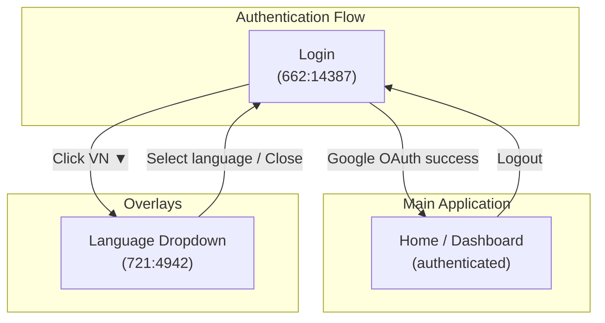
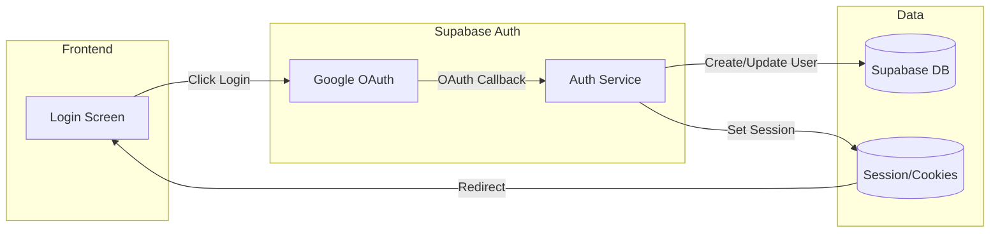

# Screen Flow Overview

## Project Info
- **Project Name**: MoMorph (Sun Annual Awards 2025)
- **Figma File Key**: 9ypp4enmFmdK3YAFJLIu6C
- **Figma URL**: https://www.figma.com/design/9ypp4enmFmdK3YAFJLIu6C
- **Created**: 2026-03-09
- **Last Updated**: 2026-03-09

---

## Discovery Progress

| Metric | Count |
|--------|-------|
| Total Screens | 1 |
| Discovered | 1 |
| Remaining | 0 |
| Completion | 100% |

---

## Screens

| # | Screen Name | Frame ID | Status | Detail File | Predicted APIs | Navigations To |
|---|-------------|----------|--------|-------------|----------------|----------------|
| 1 | Login | 662:14387 | discovered | [screen-spec.md](screens/662-14387-login/screen-spec.md) | Supabase Auth OAuth | Home (after login), Language Dropdown (721:4942) |

---

## Navigation Graph

---

## Screen Groups

### Group: Authentication
| Screen | Purpose | Entry Points |
|--------|---------|--------------|
| Login | User authentication via Google OAuth | App launch, Logout, Unauthenticated access to protected routes |

---

## API Endpoints Summary

| Endpoint | Method | Screens Using | Purpose |
|----------|--------|---------------|---------|
| Supabase `/auth/v1/authorize` | GET | Login | Initiate Google OAuth flow |
| `/auth/callback` | GET | Login | Handle OAuth redirect callback |
| Supabase `/auth/v1/token` | POST | Login | Exchange code for session |

---

## Data Flow

---

## Technical Notes

### Authentication Flow
- Google OAuth via Supabase Auth (sole auth method)
- Session managed by Supabase SSR cookies
- Session refresh via middleware (`@/libs/supabase/middleware.ts`)

### State Management
- Server state: Supabase Auth session (server-side via cookies)
- Local state: Loading state on login button (client component)

### Routing
- Router: Next.js 15 App Router
- Protected routes require authentication (middleware redirect to /login)
- Login page redirects authenticated users to home

---

## Discovery Log

| Date | Action | Screens | Notes |
|------|--------|---------|-------|
| 2026-03-09 | Initial discovery | Login | Auth flow entry point |

---

## Next Steps

- [ ] Discover remaining screens (Home/Dashboard, Profile, etc.)
- [ ] Map complete navigation paths
- [ ] Verify all API endpoints
- [ ] Review with design team
